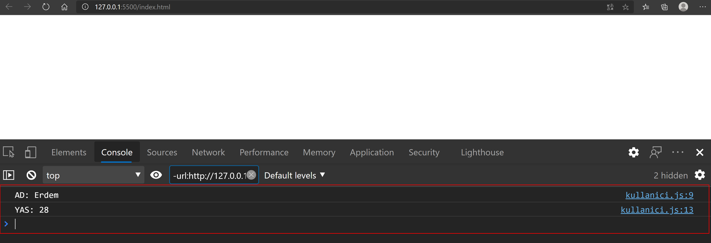

# MODULE NEDİR VE NE İŞİMİZE YARAR?

Module denen şey aslında yazdığınız javascript dosyalarıdır. Kod yazarken başımıza gelen en önemli şey kod tekrarı ve karmaşası sorunudur. Module yapısı bize ayrı dosyalarda kodlar yazıp bunları istediğimiz yerde çağırabilme imkanı sunmaktadır. Bu sayade hem kod karmaşasınından hemde tekrardan kurtulmuş oluruz.


Module yapısı node js kullanırsanız daha farklıdır. Onu bu yazımda anlatmayacağım. Bu yazının konusu JavaScript ES6 Modules olacaktır.

 

# ÖN BİLGİLENDİRME

`kullanici.js` Bu dosyada çeşitli fonksiyonlarımız olacak ve burada yazdıklarımızı `export `edip başka sayfada `import `ederecek kullanmayı göreceğiz. 

`index.js` Bu dosyaya `kullanici.js` dosyasını modül şeklinde ekleyeceğiz. Bu modülüdeki `export `edilen kodları kullanacağız.

`index.html` Sonuçları görmek için test amaçlı kullanacağımız sayfadır.


# EXPORT ETME İŞLEMİ

Javasript de yazdığımız fonksiyon, nesne vb. dışarı aktarmak için `export`kelimesini kullanırız. `export`kelimesinden sonra `default` yazmak, modülün çağrıldığı yerde varsayılanda çalışacak ve doğrudan erişilebilecek kısımdır.

İki Farklı yöntem ile dosyalarımızı `export`edebiliriz. Hangisini seçeceğiniz sizlere kalmıştır.

## Yöntem 1 (Tek Tek Dışa Aktarım Yapmak)

Bu yöntemde `export` ifadesini ilgili fonksiyon veya neslerin önüne yazarız.

```javascript
//kullanici.js dosyası

export default class Kullanici{
    constructor(_ad, _yas){
        this.ad= _ad
        this.yas =_yas
    }
}

export function kullaniciAdiGetir(kullanici){
    return console.log(`AD: ${kullanici.ad}`)
}

export function kullaniciYasiGetir(kullanici){
    return console.log(`YAS: ${kullanici.yas}`)
}
```

## Yöntem 2 (Toplu Dışarı Aktarım Yapmak)

Bu yöntemde kodlarımızın önüne herhangi bir `export` ifadesi olmadan düz yazıyoruz. ve sayfanın sonunda topdan çıkarıyoruz. `export default `işlemi dışındaki tüm durumlarda `export { } `şeklinde yazım ile export yapıyoruz. 

```javascript
//kullanici.js dosyası

class Kullanici{
    constructor(_ad, _yas){
        this.ad= _ad
        this.yas =_yas
    }
}

function kullaniciAdiGetir(kullanici){
    return console.log(`AD: ${kullanici.ad}`)
}

function kullaniciYasiGetir(kullanici){
    return console.log(`YAS: ${kullanici.yas}`)
}

//Toptan Export Yapıyoruz.
export default Kullanici
export { kullaniciAdiGetir, kullaniciYasiGetir }
```


# IMPORT ETME İŞLEMİ

- Sadece` export default` ile çıkarılanı eklemek için` import Kullanici from "./kullanici.js"` yazım şekli kullanılır. Burada yazan Kullanici takma isimdir başka birşeyde yazılabilir.

- Sadece `export `yapılanları çağırmak için `import { kullaniciAdiGetir, kullaniciYasiGetir } from "./kullanici.js"` yazım şekli kullanılır ve çağırılacaklar `{ }` içerisine yazılır.

- Hem `export `hemde `export default` ile çıkarılanları eklemek için `import Kullanici, { kullaniciAdiGetir, kullaniciYasiGetir } from "./kullanici.js"` yazım şekli kullanılır. Yani ilk iki maddenin brileşimi diyebiliriz.


> Sadece `export `ile dışa aktarılan dosyaları eklerken birebir aynı isimle çağırmayı unutmamak gerekiyor. Eğer ismini çağırdığınız yerde değiştirmek istiyor iseniz` { kullaniciAdiGetir as Yeniİsim, kullaniciYasiGetir }` şeklinde bir yazım kullnabilirsiniz `as `kelimesinden sonraki yazacağınız metin yeni ismi olacaktır.


```javascript
//index.js dosyası

import Kullanici, { kullaniciAdiGetir, kullaniciYasiGetir } from "./kullanici.js"

var yeniKullanici = new Kullanici("Erdem",28) // Yeni bir kullanıcı oluşturduk.

// kullanici.js dosyasındaki fonksiyonları kullanıyoruz.
console.log(kullaniciAdiGetir(yeniKullanici)); 
console.log(kullaniciYasiGetir(yeniKullanici));


```


# TEST

Modülümüzü head tagları arasında çağırıyoruz. Burada` type="module" `eklemeyi unutmuyoruz. Aksi taktirde modülümüzü kullanamayız.

```html
<!DOCTYPE html>
<html lang="en">
<head>
    <meta charset="UTF-8">
    <meta name="viewport" content="width=device-width, initial-scale=1.0">
    <script type="module" src="index.js"></script>
</head>
<body>
    
</body>
</html>
```

Console görüntüsü aşağıdaki gibidir.




# ÖZET

Yazmış olduduğun ilgili kodlarını export et, hangi dosyada kullanmak istiyor isen orada import et.


